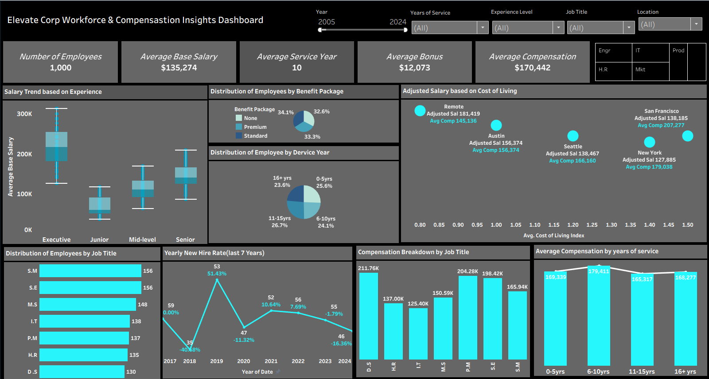

# Elevate Corp Workforce & Compensation Analytics Dashboard

An interactive Tableau dashboard analysing workforce distribution, employee compensation trends, benefit structures, and cost-of-living salary adjustments to support strategic HR decision-making.

---

## Business Introduction

Elevate Corp is a progressive organisation focused on fostering sustainable growth through innovation and employee development.  

To remain competitive, the company aims to optimise talent management strategies and compensation structures using data-driven insights. By analysing workforce data, Elevate Corp seeks to improve employee retention, align compensation with market trends, and enhance organisational performance.

---

## Business Challenge

Elevate Corp faces challenges in effectively managing and analysing employee data across multiple HR systems. Key workforce information such as salary trends, employee benefits, job roles, and performance metrics is fragmented across different sources.

This lack of integration limits visibility into critical workforce insights including:

- Compensation distribution across job levels
- Employee tenure and service trends
- Benefit package adoption
- Salary adjustments based on cost of living
- Workforce growth and hiring patterns

Without a consolidated analytics solution, HR leadership struggles to optimise compensation strategies, improve workforce planning, and support strategic talent management.

---

## Project Objective

The goal of this project is to develop an interactive HR analytics dashboard that centralises workforce data and provides actionable insights into employee compensation and organisational trends.

The dashboard enables HR leaders and executives to:

- Monitor employee distribution across job roles
- Analyse salary trends based on experience levels
- Evaluate benefit package allocation
- Understand workforce tenure distribution
- Assess salary adjustments based on cost-of-living indices
- Track hiring patterns and workforce growth trends

---

## Tools Used

- **Tableau**
- Data Visualisation
- HR Analytics
- Workforce Data Analysis

---

## Dashboard Preview

### Workforce & Compensation Insights Dashboard

---

## Key Insights

Analysis of the workforce dataset revealed several key organisational insights:

- The organisation currently manages **1,000 employees** across multiple job functions and departments.
- Average employee compensation is approximately **$170K**, with an average base salary of **$135K**.
- Employees with **6–10 years of service earn the highest average compensation**, suggesting mid-career professionals are the most financially rewarded.
- Executive roles show significantly higher salary dispersion compared to junior and mid-level employees.
- Standard and Premium benefit packages account for **over 65% of employee benefits**, indicating strong employee reliance on structured benefits programs.
- Cost-of-living adjustments show that employees in **San Francisco and New York receive significantly higher adjusted compensation** compared to other locations.

---

## Business Impact

This dashboard provides leadership with a unified view of workforce and compensation data, enabling more informed HR and strategic decisions.

The insights generated support:

- **Improved compensation planning** aligned with employee experience and job roles.
- **Better workforce planning** through analysis of tenure and hiring trends.
- **Optimisation of employee benefits allocation** across the organisation.
- **Location-based compensation adjustments** using cost-of-living insights.
- **Data-driven HR decision-making** to support long-term organisational growth.

By centralising workforce data into a single interactive dashboard, Elevate Corp can improve reporting efficiency, strengthen talent management strategies, and enhance employee retention initiatives.

---

## Project Files

Download the project resources below:

- 📊 Tableau Dashboard  
👉 [Download Tableau Workbook](elevate_workforce_dashboard.twbx)

- 📁 Dataset  
👉 [Download Dataset](employee_workforce_dataset.csv)

---

## Author

**Oluwasegun Balogun**  
Data Analyst | Power BI | SQL | Tableau | Excel
